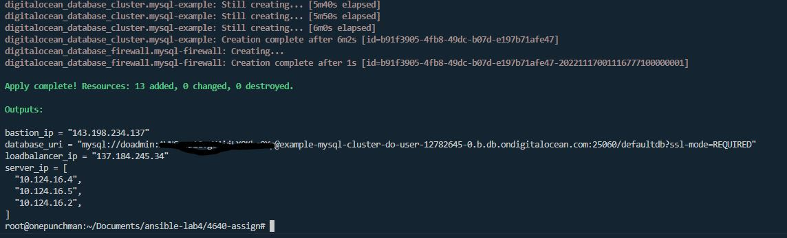
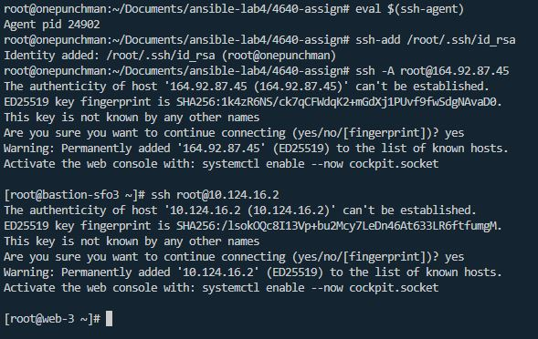
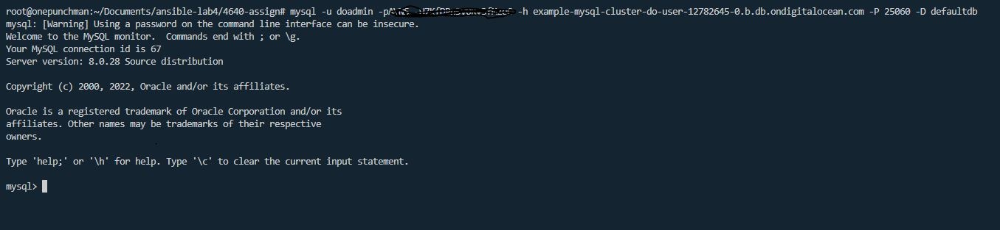
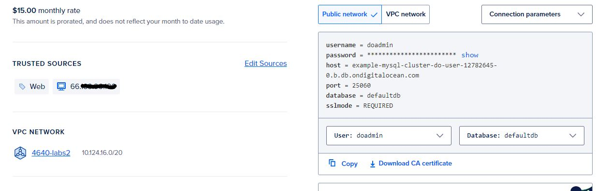

# 4640-assign
## Prerequsite
Make sure you have the following before going further
- Install terraform
- Create API keys in Digital Ocean
- Create SSH keys in Digital Ocean
- Create Project in Digital Ocean
- Save API keys in .env in root folder and source it

## Terraform
In the main.tf folder, Run cmd below to initialize:
```
terraform init
```
Terraform cheat sheet
```
terraform apply # apply the config
terraform validate # check syntax
terraform plan # check running process without actual deploy
terraform apply # actual deploy but need to type "yes"
terraform destroy # destroy the resources in current apply but need to type "yes"
```
Success example:


## bastion.tf
It creates a bastion server that allow you to connect to the webserver in the vpc via internal network

file goal
- Create the bastion server
- Attach the server to the project
- Create the firewall for ssh

After everything has configured, you should be able to ssh to the webserver through bastion server and ssh-agent

```
#In your localhost
eval $(ssh-agent)
ssh-add <path of your private key>

ssh -A root@bastion_host # ssh to your bastion server

ssh root@webserver_internal_address # ssh to the webserver via internal address in bastion server

```
Example:



## data.tf
It will pull all the resources existing resources in the digitcal ocean
file goal
- Get ssh key
- Get the project

## database.tf
It will create a database cluster and firewall in Digital ocean

file goal
- Create a mysql database cluster(You can change to other database if you want)
- Create databse firewall to limit it only be accessed by your webserver

You can add an extra rule in firewall to allow your localhost accessing it to verify it works then delete it.

Example:



## main.tf
It choose what platform provider should use and use your api keys

file goal
- Choose providers
- Use api key

## network.tf
It creates a vpc which allow your resources in the same internal network

file goal
- create vpc network

## output.tf
It will print information you want after the apply in the terminal

file goal
- Print webserver internal ip
- Print bastion host ip
- Print database connection uri
- Print loadbalancer ip

## server.tf
It will create a list of webserver, a loadbalancer and a firewall for webserver

file goal
- Create a resources tag
- Create a list of webserver
- Attach the webserverto the project
- Create a loadbalancer
- Create a firewall that the webserver can only access the resources in the same vpc


## terraform.tfvars
It define the values in your variable.tf. If you do not use .tfvars, variable will be used in default value defined in variable.tf.

file goal
- Sign value for var region
- Sign value for var droplet number
- Sign value for var droplet size
- Sign value for var droplet image name

## variables.tf
It save the variables you defined so you can use it repeatedly

file goal
- Define do_token
- Define region
- Define droplet number
- Define droplet size
- Define droplet image name

